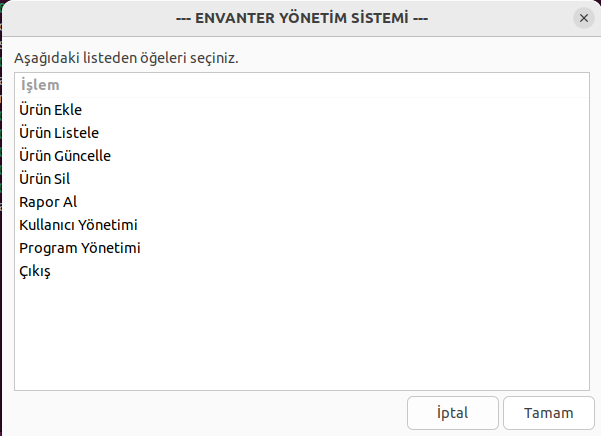
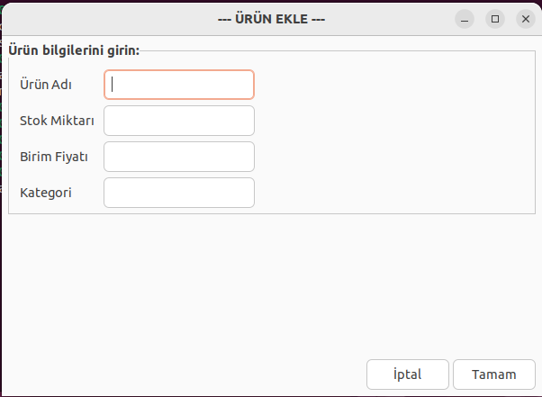
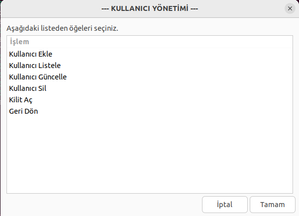
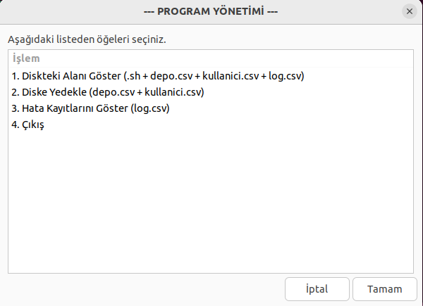
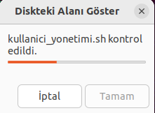

# Envanter Yönetim Sistemi
Bu proje, Zenity araçlarını kullanarak ürün ekleme, listeleme, güncelleme, silme gibi envanter yönetimi işlemlerini destekleyen kullanıcı dostu bir grafik arayüz sunar. Sistem, kullanıcı giriş doğrulaması ve yönetici/kullanıcı rolleri gibi işlevsellikler de içerir. Proje, Linux ortamında çalışmak üzere tasarlanmıştır.

## Özellikler
- Ürün Ekleme: Yeni ürünler ekleyebilirsiniz.
- Ürün Listeleme: Var olan ürünlerin listesini görüntüleyebilirsiniz.
- Ürün Güncelleme: Mevcut ürünlerin bilgilerini güncelleyebilirsiniz.
- Ürün Silme: Ürünleri silebilirsiniz.
- Kullanıcı Yönetimi: Kullanıcı ekleme, listeleme, güncelleme ve silme işlemleri.
- Veri Yedekleme: Düzenli aralıklarla veri yedekleme işlemi gerçekleştirilir.
- Kilit Açma: Kilitli kullanıcı hesaplarını açma işlemi.

## Gereksinimler
- **Zenity:** Grafiksel arayüzler için kullanılan bir araçtır.
- **Bash:** Betik dili olarak kullanılmıştır.
- **Linux Sistemi:** Zenity ve Bash, Linux ortamında çalışır.

## Kullanım
Terminalde **./giris.sh** komutu çalıştırılır.
### 1. Kullanıcı Girişi
Sistem, kullanıcı adı ve şifre doğrulaması gerektirir. Şifreler MD5 ile şifrelenmiş olarak saklanır.

- Başarılı giriş sonrası kullanıcı, ana menüye yönlendirilir.
- Yönetici rolünde giriş yaptıysanız, tüm yönetim işlevlerine erişebilirsiniz.
- Normal kullanıcı rolü yalnızca envanter işlemleriyle sınırlıdır.

### 2. Ana Menü
Ana menüde şu işlemler bulunur:

- Ürün Ekle
- Ürün Listele
- Ürün Güncelle
- Ürün Sil
- Rapor Al
- Kullanıcı Yönetimi (Sadece Yönetici)
- Program Yönetimi
- Çıkış

Her bir seçim, ilgili betiği çalıştırarak işlem yapmanıza olanak tanır.

### 3. Ürün Ekleme
Yeni ürün eklemek için:

1. Ana menüden "Ürün Ekle" seçin.
2. Gerekli bilgileri doldurun: Ürün adı, kategori, stok adedi, fiyat.
3. İşlem sonrası ürün bilgileri depo.csv dosyasına kaydedilir.

### 4. Ürün Listeleme
1. Ana menüden "Ürün Listele" seçin.
2. Tüm ürünler bir pencere içinde listelenir.

### 5. Ürün Güncelleme
1. Ana menüden "Ürün Güncelle" seçin.
2. Güncellemek istediğiniz ürün adını girin.
3. Yeni bilgileri girerek ürün kaydını güncelleyin.

### 6. Ürün Silme
1. Ana menüden "Ürün Sil" seçin.
2. Silmek istediğiniz ürünün numarasını girin.
3. Onay verdiğinizde ürün depo.csv dosyasından kaldırılır.

### 7. Rapor Alma
Raporlama işlemi ile **Stokta Azalan Ürünler** ve **En Yüksek Stok Miktarına Sahip Ürünler** listelenebilir.

### 8. Kullanıcı Yönetimi
Bu bölümde:

- Yeni kullanıcı ekleme
- Kullanıcı listeleme
- Kullanıcı güncelleme (şifre ve rol değişikliği)
- Kullanıcı silme
- Kilit açma işlemleri yapılabilir.

Kullanıcı bilgileri kullanicilar.csv dosyasında saklanır

### 9. Program Yönetimi
Programın yedekleme ve bakımı için kullanılır. Bu menüde:
- Diskteki Alanı Göster
- Diske Yedekle
- Hata Kayıtlarını Göster

seçenekleri bulunur.  
Buradan **diske yedekleme** işlemi manuel olarak yapılabilir ancak veri kayıplarını önlemek amacıyala **yedek_al.sh** ile düzenli olarak veri yedekleme işlemi gerçekleştirilir.

### 10. Kullanıcı Menüsü
Giriş ekranından yönetici olarak giriş yapıldığı zaman **ana_menu.sh**'ye erişilir. Normal kullanıcı ile giriş yapıldığı zaman ise **kullanici_menu.sh**'ye erişilir. Çünkü **yönetici** ve **kullanıcı**'nın erişim izinleri farklıdır. Bu menüde:

- Ürün Listele
- Rapor Al

işlemleri yapılabilir.

## Dosyalar

- giris.sh: Sisteme giriş işlemini başlatır.
- ana_menu.sh: Ana menü işlevlerini barındırır.
- kullanici_yonetimi.sh: Kullanıcı yönetim işlemlerini içerir.
- kullanici_menu.sh: Normal kullanıcı menüsü işlevlerini içerir.
- program_yonetimi.sh: Programın yedekleme ve diğer bakım işlevlerini barındırır.
- urun_ekle.sh: Ürün eklemek için kullanılır.
- urun_listele.sh: Ürünleri listelemek için kullanılır.
- urun_guncelle.sh: Ürün günceller.
- urun_sil.sh: Ürün siler.
- raporlama.sh: Rapor oluşturur.
- yedek_al.sh: Düzenli veri yedekleme işlevini sağlar.

## Hata Yönetimi

- Sistem, her hata durumunda log.csv dosyasına hata kaydı ekler.
- Hata logları şu bilgileri içerir: Hata numarası, zaman, kullanıcı adı, hata mesajı, betik adı, ek bilgi.

## Ek Notlar ve Görseller

- Sistem, kullanıcı dostu bir Zenity arayüzü ile tasarlanmıştır.
- Hataları önlemek ve veri kaybını engellemek için düzenli yedekleme önerilir.
- Kullanıcı rolleri, uygulama işlevselliğini sınırlandırır ve güvenlik sağlar.

## Tanıtım Videosu
Sistemin tanıtımını ve kullanımını detaylı olarak gösteren videoyu aşağıdaki bağlantıdan izleyebilirsiniz: 

[🔗 Tanıtım Videosunu İzle]( )

